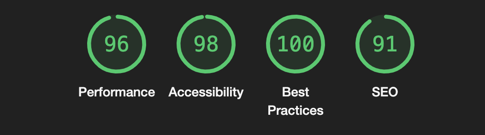

# POTR POTS landing page

Landing page for [Potr Pots](https://potrpots.com/) company. Presents the company itself, its goals and mission, team, products and services. Describes the benefits of the company's products and services. Contains a form for sending a request for a consultation.

# [DEMO](https://anastasiia-tilikina.github.io/Potr_Pots/)

# Technologies used
- HTML
- CSS
- Sass (SCSS)
- BEM
- JavaScript

# Features overview

A Pixel Perfect Layout is adaptive and responsive as well as cross-browser compatible. It works correctly on all screen sizes (mobile, tablet and desktop versions). Is is implemented using the mobile-first approach.

The code is valid HTML5 and CSS3. In order to decrease user load and avoid code duplication, styles are implemented using Sass (SCSS) including advanced features like mixins, extends, functions, conditional operators etc. 
BEM methodology is used for naming classes. This naming convention makes the code more readable and understandable, helps to avoid naming conflicts and makes the code easier to maintain and reuse.

User interaction is implemented using hover effects, transition and JavaScript. The page is interactive and has a smooth animation.

Semantic and meta tags are used. SEO optimization is done. Accessibility is improved. The page is optimized for loading speed.

*see google lighthouse report below*

# Reflections

After practicing with easier Landing page layout I decided to try to implement a more complex one combining all the knowledge in HTML/CSS I have gained so far along with some JavaScript and DOM manipulations in order to make the page more interactive.

The main challenge of this project was to implement more difficult Design then I did before and to make it responsive. I had to use more advanced CSS features like flexbox, grid, media queries, pseudo-classes and pseudo-elements along with Sass (SCSS) features like mixins, extends, functions, conditional operators etc.
